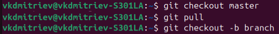
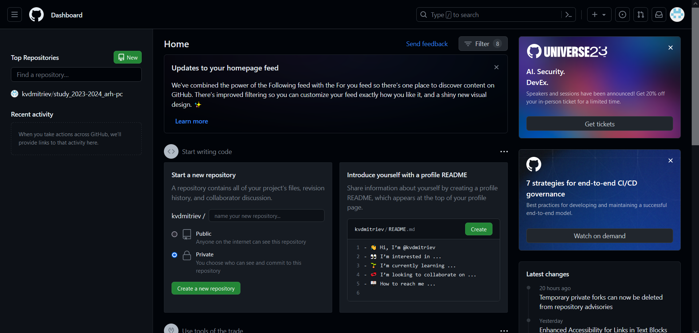
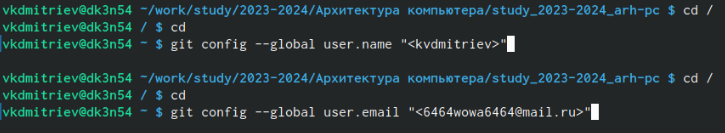
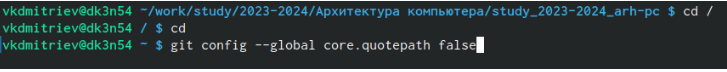
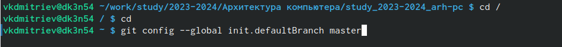
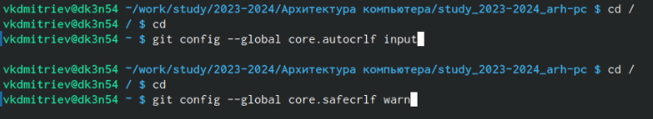
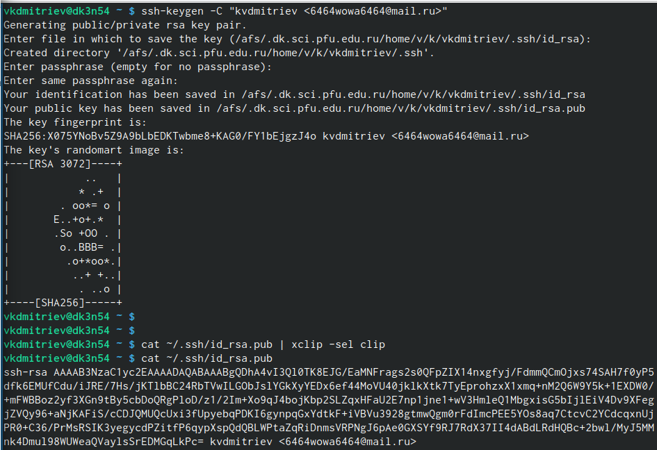
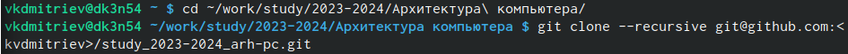
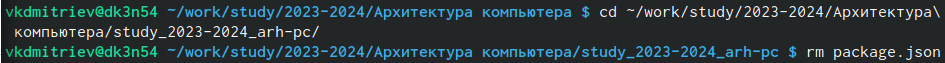
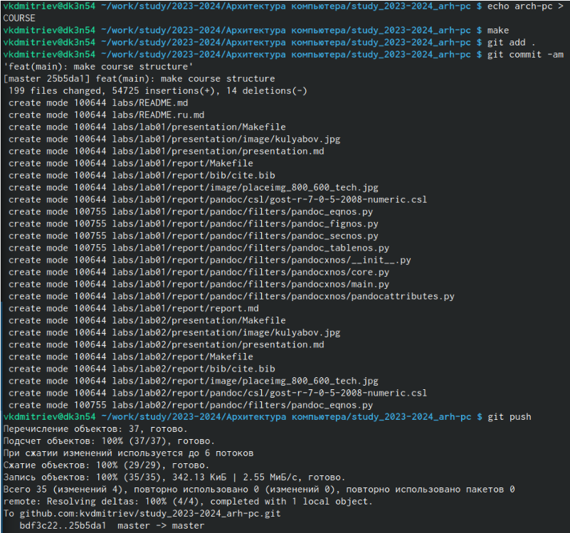

---
## Front matter
title: "Лабораторная работа №2"
subtitle: "Основы интерфейса командной строки"
author: "Дмитриев Владимир Константинович"

## Generic otions
lang: ru-RU
toc-title: "Содержание"

## Bibliography
bibliography: bib/cite.bib
csl: pandoc/csl/gost-r-7-0-5-2008-numeric.csl

## Pdf output format
toc: true # Table of contents
toc-depth: 2
lof: true # List of figures
lot: true # List of tables
fontsize: 12pt
linestretch: 1.5
papersize: a4
documentclass: scrreprt
## I18n polyglossia
polyglossia-lang:
  name: russian
  options:
	- spelling=modern
	- babelshorthands=true
polyglossia-otherlangs:
  name: english
## I18n babel
babel-lang: russian
babel-otherlangs: english
## Fonts
mainfont: PT Serif
romanfont: PT Serif
sansfont: PT Sans
monofont: PT Mono
mainfontoptions: Ligatures=TeX
romanfontoptions: Ligatures=TeX
sansfontoptions: Ligatures=TeX,Scale=MatchLowercase
monofontoptions: Scale=MatchLowercase,Scale=0.9
## Biblatex
biblatex: true
biblio-style: "gost-numeric"
biblatexoptions:
  - parentracker=true
  - backend=biber
  - hyperref=auto
  - language=auto
  - autolang=other*
  - citestyle=gost-numeric
## Pandoc-crossref LaTeX customization
figureTitle: "Рис."
tableTitle: "Таблица"
listingTitle: "Листинг"
lofTitle: "Список иллюстраций"
lotTitle: "Список таблиц"
lolTitle: "Листинги"
## Misc options
indent: true
header-includes:
  - \usepackage{indentfirst}
  - \usepackage{float} # keep figures where there are in the text
  - \floatplacement{figure}{H} # keep figures where there are in the text
---

# Цель работы

Целью работы является изучить идеологию и применение средств контроля версий.
Приобрести практические навыки по работе с системой git.

# Выполнение лабораторной работы

А) Изучаем базовые комады работы с git из теоретической части и учимся их
использовать
1. Проверяем и получаем изменения центрального репозитория
Рис. @1
{#1 width=70%}
Это необходимо для синхронизации изменений в git, особенно при одновременной
работе нескольких людей в одном репозитории.
2. Проверяем внесённые изменения перед размещением в центральном репозитории
Рис. 2
{#3 width=70%}
Эта команда позволяет проверить, какие файлы были изменены, и удалить ненужные
изменения перед размещением в центральный репозиторий
3. Проверяем текст на соблюдение правил коммитов
Рис. 3
{#3 width=70%}
Эта команда позволяет найти ошибки и исправить их до коммита.
4. Добавляем и удаляем файлы из коммита
Рис. 4
{#4 width=70%}
Эти команды необходимы для добавления и удаления файлов из коммита.
5. Сохраняем изменения в текущем каталоге.
Рис. 5
{#5 width=70%}
После изменений файлов необходимо сохранить их для создания коммита.
6. Сохраняем изменения и поясняем, что было сделано
Рис. 6
{#6 width=70%}
Сохраняем изменения в коммит, чтобы далее их можно было внести в центральный
репозиторий. Комментируем, чтобы знать, что именно сохраняем.7. Отправляем изменения в центральный репозиторий
Рис. 7
{#7 width=70%}
Для сохранения изменений в центральном репозитории необходимо использовать
одну из данных команд.
B) Выполнение самостоятельной работы
1. Создаём аккаунт на github.com
Рис. 8
{#8 width=70%}
Для этого регистрируемся на github.com
2. Настраиваем git в терминале
Рис. 9
{#9 width=70%}
Указываем имя владельца репозитория и почту, чтобы соединить подключить git
Рис. 10
{#10 width=70%}
Настраиваем utf-8 в выводе сообщений git
Рис. 11
{#11 width=70%}
Задаём начальную ветку master
Рис. 12
{#12 width=70%}
Задаём параметры autocrlf и safecrlf
3. Создаём SSH ключ
Рис. 13
{#13 width=70%}
Далее загружаем ключ на github, скопировав его командой cat4. Создаём рабочее пространство и репозиторий курса
Рис. 14
{#14 width=70%}
Далее копируем шаблон репозитория курса с https://github.com/yamadharma/course-
directory-student-template
Рис. 15
{#15 width=70%}
Далее открываем каталог курса и клонируем созданный репозиторий с помощью
команды git clone
5. Настройка каталога курса
Переходим в каталог курса и удаляем лишние файлы
Рис. 16
{#16 width=70%}
Далее создаём необходимые каталоги и отпрвляем файлы на сервер
Рис. 17
{#17 width=70%}

# Выводы

Я изучил идеологию и применение средств контроля версий git, приобрёл
практические навыеи по работе с системой git.

# Список литературы{.unnumbered}

::: {#refs}
:::
