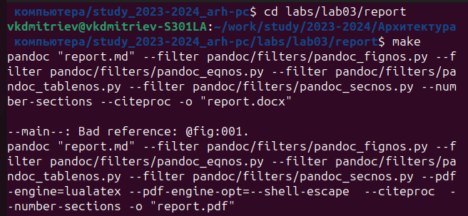
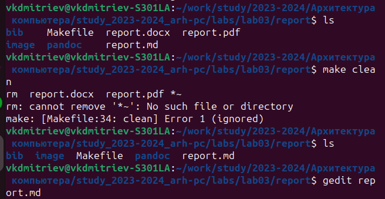
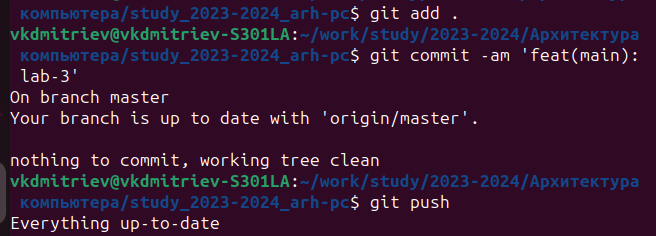

---
## Front matter
title: "Отчёт по лабораторной работе №3"
subtitle: "Простейший вариант"
author: "Дмитриев Владимир Константинович"

## Generic otions
lang: ru-RU
toc-title: "Содержание"

## Bibliography
bibliography: bib/cite.bib
csl: pandoc/csl/gost-r-7-0-5-2008-numeric.csl

## Pdf output format
toc: true # Table of contents
toc-depth: 2
lof: true # List of figures
lot: true # List of tables
fontsize: 12pt
linestretch: 1.5
papersize: a4
documentclass: scrreprt
## I18n polyglossia
polyglossia-lang:
  name: russian
  options:
	- spelling=modern
	- babelshorthands=true
polyglossia-otherlangs:
  name: english
## I18n babel
babel-lang: russian
babel-otherlangs: english
## Fonts
mainfont: PT Serif
romanfont: PT Serif
sansfont: PT Sans
monofont: PT Mono
mainfontoptions: Ligatures=TeX
romanfontoptions: Ligatures=TeX
sansfontoptions: Ligatures=TeX,Scale=MatchLowercase
monofontoptions: Scale=MatchLowercase,Scale=0.9
## Biblatex
biblatex: true
biblio-style: "gost-numeric"
biblatexoptions:
  - parentracker=true
  - backend=biber
  - hyperref=auto
  - language=auto
  - autolang=other*
  - citestyle=gost-numeric
## Pandoc-crossref LaTeX customization
figureTitle: "Рис."
tableTitle: "Таблица"
listingTitle: "Листинг"
lofTitle: "Список иллюстраций"
lotTitle: "Список таблиц"
lolTitle: "Листинги"
## Misc options
indent: true
header-includes:
  - \usepackage{indentfirst}
  - \usepackage{float} # keep figures where there are in the text
  - \floatplacement{figure}{H} # keep figures where there are in the text
---

# Цель работы

Цель данной работы --- познакомиться с основными возможностями разметки Markdown.

# Задание

Создать отчёт о выполнении третьей лабораторной работы по изучению Markdown.

# Теоретическое введение

: Описание некоторых каталогов файловой системы GNU Linux {#tbl:std-dir}

| Имя каталога | Описание каталога                                                                                                          |
|--------------|----------------------------------------------------------------------------------------------------------------------------|
| `/`          | Корневая директория, содержащая всю файловую                                                                               |
| `/bin `      | Основные системные утилиты, необходимые как в однопользовательском режиме, так и при обычной работе всем пользователям     |
| `/etc`       | Общесистемные конфигурационные файлы и файлы конфигурации установленных программ                                           |
| `/home`      | Содержит домашние директории пользователей, которые, в свою очередь, содержат персональные настройки и данные пользователя |
| `/media`     | Точки монтирования для сменных носителей                                                                                   |
| `/root`      | Домашняя директория пользователя  `root`                                                                                   |
| `/tmp`       | Временные файлы                                                                                                            |
| `/usr`       | Вторичная иерархия для данных пользователя                                                                                 |

# Выполнение лабораторной работы

Переходим в каталог курса сформированный при выполнении лабораторной работы №2 с помощью команды cd, обновляем локальный репозиторий с помощью команды git pull.
Это необходимо делать каждый раз перед началом работы для синхронизации версий.

Рис. @1
{#1 width=70%}

Далее перейдём в каталог с шаблоном отчёта по лабороторной работе №3 и проведём компиляцию с использованием Makefile. Для этого используем команду make, которая позволяет нам скомпилировать файлы формата .pdf и .docx на основе файла .md.
Проверяем наличие файлов командой ls.

Рис. @2
{#2 width=70%}

Далее удаляем полученные файлы с помощью команды make clean. Проверяем каталог командой ls.
Открываем файл report.md с помощью команды gedit для изучения. Заполняем отчёт по шаблону и загружаем файлы на github, используя ранее изученыне команды git add, git commit, git push.

Рис. @3
{#3 width=70%}

# Выводы

Я познакомился и научился работать с основными возможностями разметки Markdown.

# Список литературы{.unnumbered}

::: {#refs}
:::
